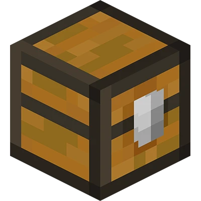
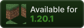
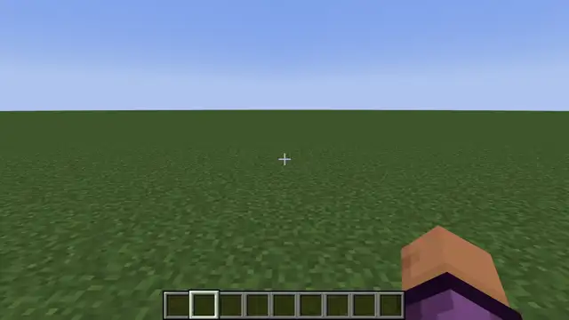
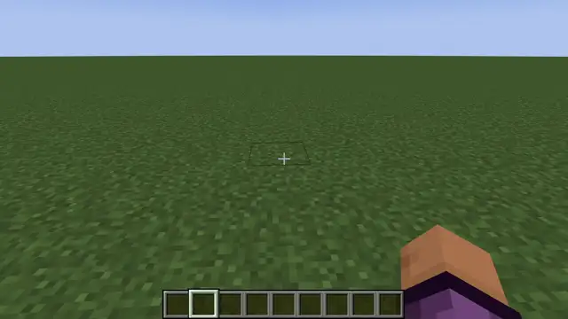

  
    
  
  &nbsp
  
  &nbsp
  
    
  
  &nbsp
  

# 🗿 Head Database

A server-side mod (also usable in singleplayer) that enables players to retrieve all different kinds of textured player heads, which are great for decoration.

## 🆕 What does it add?

Access to about 85k different player heads in modded environments!

### Commands

#### `/hdb`
- Opens the Head Database menu
- First, a list of categories is shown
- Once a category is clicked, a paginated view of categorized player heads is shown
- Clicking any head will give it to the player

#### `/hdb search <...>`
- Opens a menu with search results
- Includes search term matches in name and tags of the individual heads
- You can use multiple search terms by separating them with spaces

#### `/hdb reload`
- Reloads the config

## ⚙️ Configuration

The configuration file is located at:

### Forge

| Client                                                                 | Server                                                         |
|------------------------------------------------------------------------|----------------------------------------------------------------|
| `.minecraft/saves/<world_name>/serverconfig/head_database-server.toml` | `<server_folder>/world/serverconfig/head_database-server.toml` |

### Fabric

`.minecraft/config/head-database-server.json`

### Options

#### `mode`
- Specifies which permission mode to use (who is allowed to use the command?)
- Can be either of:
  - `OP_ONLY`: Operators only
  - `WHITELIST`: Operators and additional whitelisted players
  - `EVERYONE`: Everyone can run the commands

#### `required_op_level`
- Specifies the required operator level (0-4) when using either `OP_ONLY` or `WHITELIST` mode

#### `whitelist`
- List of non-operator player names or UUIDs allowed to use the command when using `WHITELIST` mode

>ℹ️ `/hdb reload` can only be used by operators, regardless of config values

## 🌐 Where does the data come from?

The database is fetched from the public domain repository at https://github.com/TheSilentPro/heads.
When the server starts (internal or dedicated), this ~15&thinsp;MB JSON file is downloaded and parsed.  